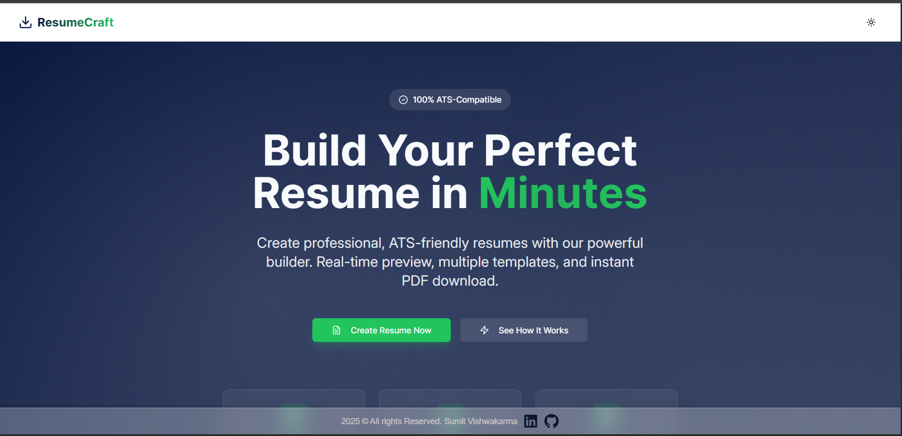

# Resume Builder 📄✨
---
## Preview..
---


---

### What is it?

A sleek and powerful web application built with React (frontend) and Node.js (backend) that lets you effortlessly create, customise, and download beautiful professional resumes.

---

### 🌟 Features
- 🎨 Customizable Templates: Choose from elegant, professionally-designed resume layouts.

- ⚡ Real-Time Preview: Instantly view changes while editing.

- 🧾 PDF Export: Generate and download print-ready resumes with a single click.

- 📱 Responsive Design: Optimized for desktops, tablets, and mobile devices.

- 🧠 Structured Input Fields: Add personal details, education, experience, and skills efficiently.

- 💾 Persistent Storage: Save user data for easy access and future edits.

---
### 🛠️ Tech Stack

- **Frontend:** React, Tailwind CSS (or CSS3), Vite

- **Backend:** Node.js, Express.js

- **Additional Tools:** REST APIs, npm
---
### 🔗 Live Demo

> 👉 Try it here: [Resume Builder Live](https://resume-builldnetlify.app/)

---
### ⚙️ Getting Started

1. Clone this repository

2. Install dependencies with npm install

```Vs Code terminal
    npm install
```

3. Run the development servers (frontend and backend)

--- 
### 🎯 Purpose

The project aims to provide a user-friendly and reliable platform for creating visually appealing, ATS-friendly resumes — perfect for professionals, students, and job seekers.

---
### 🤝 Contributing

Contributions are always welcome! Feel free to open issues, suggest improvements, or submit pull requests.

---
### 📄 License
Licensed under the MIT License.

---
[Visit Portfolio](https://sumit-vishwakarma.netlify.app/)
**Made with ❤️ Sumit Vishwakarma**